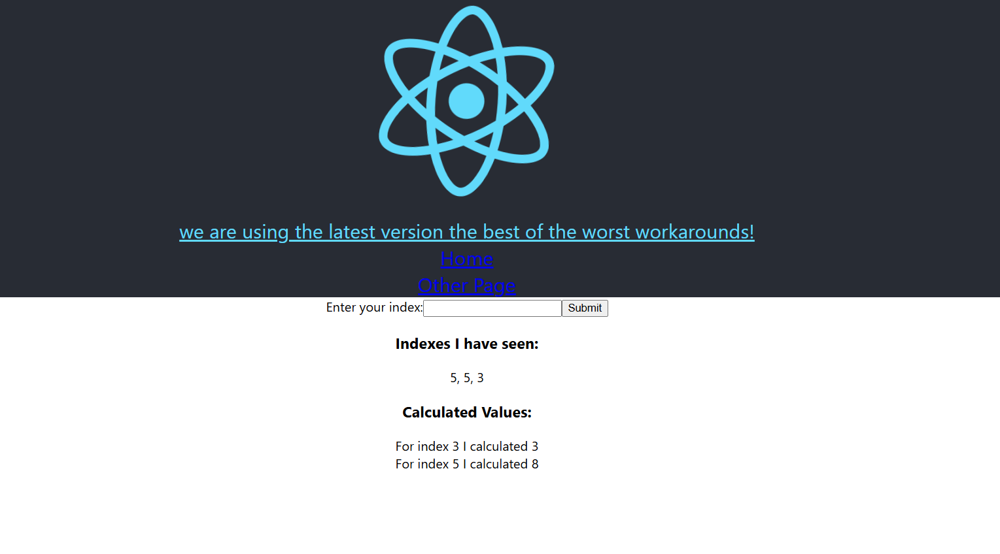
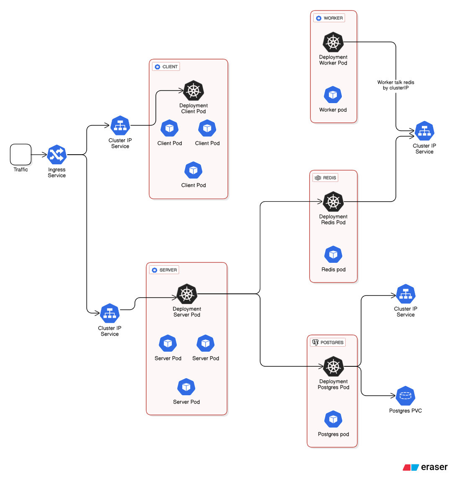

# Fibonacci Sequence



**Short description / وصف مختصر**

This project is a microservices-based Fibonacci calculator deployed in a Kubernetes cluster. The system accepts an index from a React frontend, forwards it to an Express API, and calculates the Fibonacci value for that index in a distributed, fault-tolerant way.

---

## Table of contents

1. [Architecture](#architecture)
2. [Technologies](#technologies)
3. [Repository layout](#repository-layout)
4. [Local development](#local-development)
5. [Docker & Kubernetes](#docker--kubernetes)
6. [Environment variables](#environment-variables)
7. [API endpoints](#api-endpoints)
8. [Data flow](#data-flow)
9. [Troubleshooting](#troubleshooting)
10. [Testing](#testing)
11. [Contributing](#contributing)
12. [License](#license)

---

## Architecture



High-level components:

* **React (client)** — single-page app where user submits an index.
* **API (Express)** — receives index submissions and exposes API endpoints.

  * Writes received indices to **Postgres** (permanent history).
  * Pushes the index into **Redis** (as a job or key placeholder) for processing.
* **Worker** — a separate process that watches Redis for new indices, computes the Fibonacci value, and writes the result back into Redis (keyed by index).
* **Redis** — used as ephemeral store/cache and a simple task queue between the API and worker.
* **Postgres** — persistent store of all received indices (audit/history).
* **Kubernetes** — manifests for deploying client, server, worker, Redis, and Postgres.

---

## Technologies

* Frontend: React, Axios
* Backend: Node.js, Express
* Worker: Node.js (or Python/Go if you prefer)
* Cache/Queue: Redis
* Database: PostgreSQL
* Containerization: Docker
* Orchestration: Kubernetes (manifests located in `/k8s`)
* CI/CD: (suggested) GitHub Actions / GitLab CI

---

## Repository layout

```text
microservices/
├─ client/                  # React app
├─ server/                  # Express API
│  ├─ worker/               # Worker that watches Redis and calculates fib
│  └─ src/
├─ k8s/                     # Kubernetes manifests (Deployments, Services, ConfigMaps, Secrets)
├─ docker-compose.yml       # Optional: compose for local dev
├─ README.md                # <- this file
└─ docs/
   ├─ architecture-diagram.png
   └─ screenshot-frontend.png
```

---

## Local development

### Prerequisites

* Docker & Docker Compose
* Node.js >= 18 (for local dev of client/server)
* kubectl (optional, for k8s testing)

### Quick start (using docker-compose)

1. Copy `.env.example` to `.env` in each of `client/` and `server/` and set values.

2. From project root run (starts Postgres, Redis, server, worker, client):

```bash
docker compose up --build
```

3. Open the client in your browser (by default `http://localhost:3000`).

### Local (without docker)

Run Postgres and Redis locally (or use Docker for them), then:

```bash
# server
cd server
npm install
npm run dev

# worker (in a separate shell)
cd server/worker
npm install
npm run dev

# client
cd client
npm install
npm start
```

---

## Docker & Kubernetes

### Build images

```bash
# from repo root (example names)
docker build -t your-dockerhub-username/fibonacci-client:latest ./client
docker build -t your-dockerhub-username/fibonacci-server:latest ./server
docker build -t your-dockerhub-username/fibonacci-worker:latest ./server/worker
```

Push to your container registry and update the images in `k8s/` manifests.

### Deploy to Kubernetes (example)

```bash
kubectl apply -f k8s/
```

The `k8s/` folder should contain:

* `deployment-client.yaml`
* `service-client.yaml`
* `deployment-server.yaml`
* `service-server.yaml`
* `deployment-worker.yaml`
* `deployment-redis.yaml` / `statefulset-redis.yaml`
* `deployment-postgres.yaml` / `statefulset-postgres.yaml`
* `configmap.yaml` (for non-secret envs)
* `secret.yaml` (for DB passwords)

Notes:

* Use `HorizontalPodAutoscaler` for the server & worker if you expect load.
* Use `PersistentVolumeClaim` for Postgres data.

---

## Environment variables

Example (server `.env`)

```env
PORT=5000
PG_HOST=postgres
PG_USER=postgres
PG_PASSWORD=postgrespassword
PG_DATABASE=fibdb
REDIS_HOST=redis
REDIS_PORT=6379
SECRET_KEY=some-secret
```

Example (client `.env`)

```env
REACT_APP_API_URL=http://localhost:5000
```

---

## API endpoints

Assuming server runs on `http://<server>:5000`.

* `POST /api/values` — submit an index to calculate. Body:

```json
{ "index": 10 }
```

* `GET /api/values/current` — get current cached calculated values (from Redis). Returns object mapping index->value or index->"processing".

* `GET /api/values/all` — get list of all submitted indices (from Postgres).

### Example curl

```bash
curl -X POST http://localhost:5000/api/values -H "Content-Type: application/json" -d '{"index": 12}'
curl http://localhost:5000/api/values/current
curl http://localhost:5000/api/values/all
```

---

## Data flow

1. User submits index in React UI.
2. Client sends POST `/api/values` to Express server.
3. Express server:

   * saves the index into Postgres.
   * writes a placeholder into Redis (e.g. key `values:<index>` = "processing" and also pushes the index to a `jobs` list or publishes on a channel).
4. Worker watches Redis (e.g. `BLPOP` on `jobs` list or subscribe to a channel), pops the index, computes Fibonacci value, and writes the result back into Redis key `values:<index>`.
5. Client polls or websockets to GET `/api/values/current` to display calculated values.

---

## Implementation notes & tips

* The Fibonacci calculation should be implemented with memoization for speed (or use an efficient iterative algorithm). For large indices, consider using big integers (BigInt in JS) or restrict the allowed index range.
* Use Redis TTLs if you want cached results to expire.
* For production, secure your Postgres with proper credentials and network policies.
* Consider switching Redis from a single instance to a Redis cluster if you need high availability.

---

## Troubleshooting

* **Server can't connect to Postgres**: check `PG_HOST`, `PG_USER`, `PG_PASSWORD`, and that Postgres is accepting connections.
* **Worker not seeing jobs**: verify Redis host/port and that the server pushes to the exact queue the worker monitors.
* **Kubernetes pod keeps restarting**: `kubectl logs <pod>` and `kubectl describe pod <pod>` to inspect events and crash loops.

---

## Testing

* Unit-test the Fibonacci function (edge cases: 0, 1, negative inputs, large numbers).
* Integration test: run docker-compose and verify end-to-end flow (submit index -> worker computes -> client displays value).

---

## Contributing

1. Fork the repo
2. Create a feature branch
3. Make changes and add tests
4. Open a PR with a clear description

Please follow conventional commit style and keep PRs small and focused.

---

## License

This project is licensed under the MIT License. See `LICENSE` for details.

---

If you want, I can:

* add real diagrams (I can generate an architecture PNG and frontend screenshots for the `docs/` folder),
* produce Kubernetes manifest examples (I can scaffold them in `k8s/`), or
* create a polished `docker-compose.yml` for local development.

Tell me which of the above you want me to add and I'll update the README accordingly.
